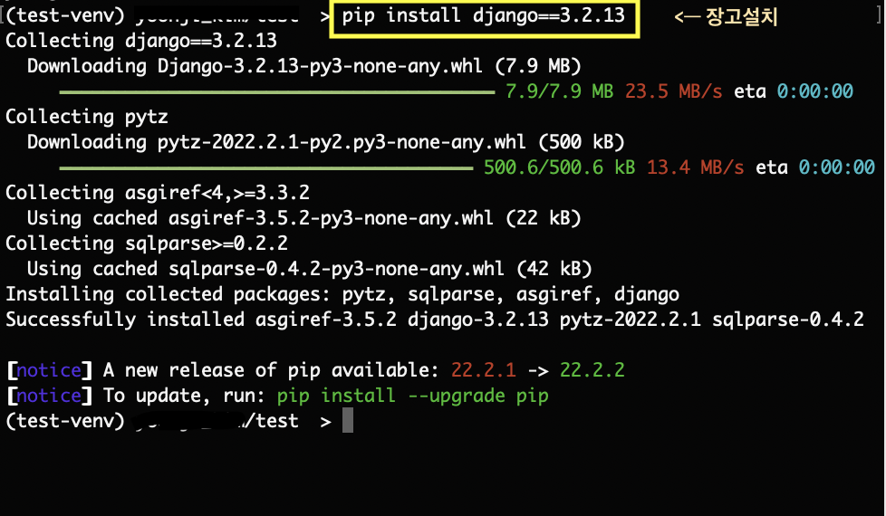

### 0921

# Django1

### 나만의 장고 개발환경 설정 가이드

>  MacOS를 기본으로 합니다.

#### 1. 터미널을 열어 준다.`맥에서 터미널은 launchpad>기타>터미널`

#### 2.  가상환경설정하기

1. `mkdir 폴더명` 으로 폴더만들기
2. `cd  폴더명/` 폴더로 들어가기
3.  `python3 -m venv 가상환경이름 `  파이썬버전확인해서 설정하기
4. `ls`로 잘 만들어졌나 확인.
5. `cd 가상환경폴더` 로 만든 가상환경 폴더 들어가기
6. 경로변경됐나 확인하고 `ls`로 다시 폴더안에 파일들 잘 만들어졌나 확인

#### 3. 가상환경 활성화하기

1. `source 가상환경이름/bin/activate` 입력하여 가상환경 활성화하기
2. 앞에 활성화됐는지 확인하기

#### 4. 장고설치

1. `pip install django==3.2.13` 장고 설치하기
   - 최신버전 4 가 있긴하지만 오류가 많을 수 있어 3으로 설치
   - 최신버전 설치를 원한다면 `pip install django` 를 입력하면된다.

​	`pip list`로 잘깔렸나 확인하기

#### 5. 장고 프레임워크 로드하기

1. `django-admin startproject 프젝이름 .`입력
   - 여기서 . 은 현재폴더라는 뜻이다. 
2. 엔터 누르고 아무것도 안뜨면 잘된것.
3. `ls`로  확인하기. 위의 사진처럼 나오면 잘 나온것이다.

#### 6. 서버 구동하기

1. `python3 manage.py runserver`입력해서 서버구동하기
2. 위의 사진처럼 나오면 통과

#### 7. 서버확인하기

1. 브라우저를 실행시켜 주소창에 localhost:8000 으로 접근해 봅니다. 

2. 아래와 같이 로켓이 날아 가고 있는 화면이 나온다면 장고 설치와 구동에 성공

   